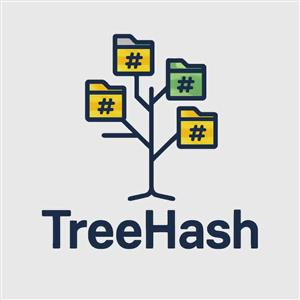

# TreeHash



[](LICENSE)
[](https://en.wikipedia.org/wiki/C%2B%2B17)
[](https://cmake.org)
[](#)
[](https://github.com/panoskalf/TreeHash/actions/workflows/ci-ubuntu.yml)
[](https://github.com/panoskalf/TreeHash/actions/workflows/ci-macos.yml)
[](https://github.com/panoskalf/TreeHash/actions/workflows/ci-windows.yml)

Recursive directory SHA256 calculator with parallel processing. Efficiently computes hashes for all files in a directory tree using multi-threaded, size-based load balancing.

## Features

- **Multi-threaded processing** with intelligent, size-based load balancing
- **Cross-platform compatibility** (Windows, Linux, macOS)
- Recursive directory traversal with efficient chunked file reading
- Configurable directory exclusion (defaults to skipping `.git` and `build`)
- `sha256sum`-compatible output - pipeable, scriptable, verifiable with `sha256sum -c` or TreeHash's own `--check`
- Memory efficient - processes large files in 64KB chunks

## Quick Start

**Build:**
```bash
cmake -S . -B build
cmake --build build
```

**Usage:**
```bash
./TreeHash <path-to-directory> [options]

  -v, --verbose      Print per-thread progress to stderr
  -x, --exclude arg  Directory names to skip (comma-separated or
                      repeatable) (default: .git,build)
  -c, --check arg    Check against a previously written manifest
  -h, --help         Print usage
```

**Example Output:**
```
$ ./TreeHash . > manifest.txt
$ cat manifest.txt
94906c8dcb0b88620af9f468597ca0217e96ed2c56a0e1ab8d23a56b2175e886  ./main.cpp
ce09f62fb76394574f021b992b98d6cc249f3cf1c32cc79b8e6b320f881238e0  ./README.md
...
$ sha256sum -c manifest.txt
./main.cpp: OK
./README.md: OK
$ ./TreeHash . --check manifest.txt
./main.cpp: OK
./README.md: OK
...
```

Progress and summary statistics print to stderr, so stdout stays a clean, redirectable checksum manifest. `--check` exits non-zero if any file is `FAILED` or `MISSING`.

## Requirements
C++17 compiler, CMake 3.20+. Dependencies (sha2, cxxopts) fetched automatically.